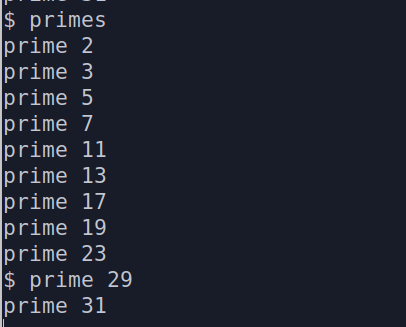

# Lab Record
## system call
How does user programs use system call?  
1. user programs include *user.h* and then it can use system call
2. but *user.h* only has declarations, where are the definition?
3. see *usys.pl*
4. after `$ make fs.img`, we have *usys.S* generated
5. we see `#include "kernel/syscall.h"` and how to enter syscall(take sleep for example)
```
.global sleep
sleep:
 li a7, SYS_sleep
 ecall
 ret
```
6. from *kernel/syscall.h* we know SYS_sleep is a macro， see *kernel/syscall.c* below
```
static uint64 (*syscalls[])(void) = {
...
[SYS_sleep]   sys_sleep,
[SYS_uptime]  sys_uptime,
...
};
```
```
void
syscall(void)
{
  int num;
  struct proc *p = myproc();

  num = p->tf->a7;
  if(num > 0 && num < NELEM(syscalls) && syscalls[num]) {
    p->tf->a0 = syscalls[num]();
  } else {
    printf("%d %s: unknown sys call %d\n",
            p->pid, p->name, num);
    p->tf->a0 = -1;
  }
}
```
7. so what `li a7, SYS_sleep` does is it tells kernel that it wants to execute sys_sleep  
(user programs store SYS_sleep in a7 and then kernel fetch a7's value)

## primes.c
why this happen?  
  
reason: races among sh, primes, and std buffer?  
```
wait();
close(1);
exit();
```
so when primes' all children and primes itself terminate,  
races happen between sh and std buffer  input from primes and its children.  
solution: use something like fflush(stdout)
hack: add sleep() in primes
```
wait();
sleep(3);
close(1);
exit();
```