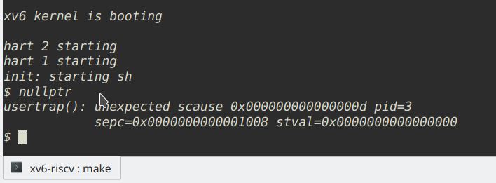

# ch3 - Exercise

## 1. what is RISC-V's device tree?
TODO

## 2. write sbrk to investigate page table
just refer *sbrk.c*

## 3. Modify xv6 to use super pages for the kernel.
Basically, we create a page table entry in level-1 page table, instead of level-0,  
then we have 9-bit longer address, which forms **2-megabtye** page now.

steps:
1. In *kernel.ld*: change `etext` to align with a super page, i.e., **2 megabyte**
2. In *kalloc.c*: freerange's `end` should align with a super page too (In *riscv.h*: add `SPGSIZE` macro)
3. In *vm.c*: add `kvmsmap`, `mapspages` and `swalk` (In *defs.h*: add relevant declaration)

view page table, breakpoint at procinit():


## 4. prohibit address 0 in user program
First, *Makefile* generate .text not from 0(from 0x1000 instead):
```
_%: %.o $(ULIB)
	$(LD) $(LDFLAGS) -N -e main -Ttext 0x1000 -o $@ $^
	$(OBJDUMP) -S $@ > $*.asm
	$(OBJDUMP) -t $@ | sed '1,/SYMBOL TABLE/d; s/ .* / /; /^$$/d' > $*.sym
```

Second, change initial `sz` in *exec.c*:
```
// Load program into memory.
sz = 0;		->		sz = 4096;
```

~~Problem: p->sz ?~~  
~~Now in *sysfile.c* line 426, 436~~  
~~and *proc.c* line 323~~

A process's `sz` has been split into two meanings.
One for max address, the other for program size, i.e., max address - 4096

Third, change `uvminit`, `uvmfree` and `uvmcopy` in *vm.c* 

Fourth, change `userinit` and code of `initcode` in *proc.c*  
initcode's argv has two element:
```
# char *argv[] = { init, 0 };
.p2align 2
argv:
  .long init
  .long 0
```
we should relocate `init` to be `0x1020` in *proc.c*'s `uchar initcode[]` 

Left: how to handle page fault exception?


## 5. interpreting for sh
refer to *sh.c* and *interpret*

## 6. KASLR - kernel address space randomization (TODO)
[https://wiki.qemu.org/Features/VirtIORNG](https://wiki.qemu.org/Features/VirtIORNG)
[https://elixir.bootlin.com/linux/v2.6.28/source/include/linux/virtio_config.h](https://elixir.bootlin.com/linux/v2.6.28/source/include/linux/virtio_config.h)
[https://elixir.bootlin.com/linux/v2.6.28/source/drivers/virtio](https://elixir.bootlin.com/linux/v2.6.28/source/drivers/virtio)

In *Makefile*:
```
QEMUOPTS += -device virtio-rng-pci
```
next step?

The virtio doc in the directory of *xv6-riscv/doc* might be useful.